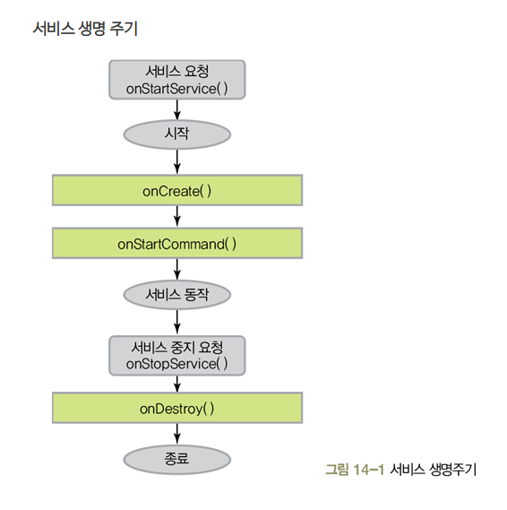

### 1. 개요
Service는 안드로이드 Application을 구성하는 4가지 컴포넌트 중에 하나이다. 
안드로이드 공식 문서에서는 Service 를 사용자 인터페이스를 제공하지 않고 백그라운드에서 오래 실행되는 작업을 수행할 수 있는 애플리케이션 구성 요소
설명하고 있는데, 이 부분이 가장 이해하면서 헷갈렸던 부분이다. Foreground service 는 사용자에게 보여지는 상태에서 작업이 수행되고 있지 않은가? 라고 생각이 들었기 때문이다.서

### 2. 구성 요소
서비스는 foreground service, background service, bind service 로 나뉘어진다. 

foreground service: 주로 사용자가 볼 수 있는 작업에 실행된다. foreground service 를 등록하려면 notification 을 등록해야 하는데,
notification을 등록하지 않아도 foreground service 를 꼼수를 통해 실행할 수는 있으나, 해당 서비스가 지속되기 위해서는 백그라운드에서
감시가 필요하다. 

background service: 사용자가 보지 않는 작업들을 주로 수행하며, 배터리 이슈로 최근에는 앱에서 백그라운드 서비스를 제한하는 추세이다.

foreground application 과 사용자가 상호작용을 해야하는 경우(앱이 켜져있을 때만 실행되어야 하는 경우) 에는 스레드를 쓴다.
즉, Service 는 반드시 필요한 경우가 아니라면 지양하는 것이 맞다.

### 3. 생명주기

_ the end _
